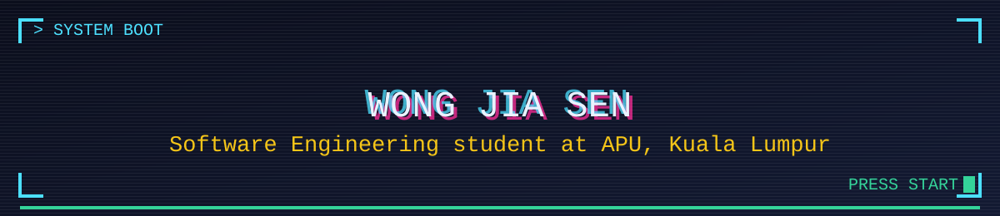

<picture>
  <source media="(prefers-color-scheme: dark)" srcset=".github/assets/banner-dark.svg">
  <source media="(prefers-color-scheme: light)" srcset=".github/assets/banner-light.svg">
  
</picture>

<br/>

<table align="center">
<tr>
<td align="center" width="140">
  
  <br/><br/>
  <a href="https://github.com/jasonwong1025">
    
  </a>
  <br/>
  <a href="https://komarev.com/ghpvc/?username=jasonwong1025">
    
  </a>
</td>
<td align="left" valign="middle" width="75%">

  
  
  
  

  <br/><br/>

  Full-stack developer focused on clean APIs and well-crafted interfaces. Open to collaboration, freelance work, and open-source contributions.

</td>
</tr>
</table>

### `$ whoami`

```
$ cat about.txt
> Software Engineering student at Asia Pacific University, Kuala Lumpur.
> Building clean, maintainable software across the full stack: frontends, APIs, databases.

$ cat status.log
> Exploring new stacks, shipping side projects, and learning better architecture.

$ ls portfolio/
> jasonwong.top, featuring shipped projects, skills, and experience.
```

### `$ inventory --list`

<table align="center">
<tr>
<td align="center" width="33%"><code>$ languages</code><br/><br/>
  
</td>
<td align="center" width="33%"><code>$ frameworks</code><br/><br/>
  
</td>
<td align="center" width="33%"><code>$ tools &amp; db</code><br/><br/>
  
</td>
</tr>
</table>

### `$ stat --readout`

<table align="center">
<tr>
<td valign="top">
  
</td>
<td valign="top">
  
</td>
</tr>
</table>

<p align="center">
  
</p>

### `$ continue?`

<p align="center">
  <a href="https://jasonwong.top">
    
  </a>
  <a href="https://jasonwong.top/#contact">
    
  </a>
  <a href="https://github.com/jasonwong1025?tab=followers">
    
  </a>
</p>
