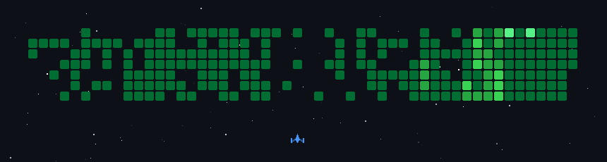

<picture>
  <source media="(prefers-color-scheme: dark)" srcset=".github/assets/banner-dark.svg">
  <source media="(prefers-color-scheme: light)" srcset=".github/assets/banner-light.svg">
  
</picture>

<br/>

<table align="center">
<tr>
<td align="center" width="140">
  
  <br/><br/>
  <a href="https://github.com/jasonwong1025">
    
  </a>
  <br/>
  <a href="https://komarev.com/ghpvc/?username=jasonwong1025">
    
  </a>
</td>
<td align="left" valign="middle" width="75%">

  
  
  
  

  <br/><br/>

  Full Stack Developer building web, mobile, and system solutions end to end. Software Engineering undergraduate at APU. Open to collaboration and freelance work.

</td>
</tr>
</table>

### `$ whoami`

```
$ cat about.txt
> Full Stack Developer based in Kuala Lumpur, Malaysia.
> Software Engineering undergraduate at Asia Pacific University (APU), CGPA 3.82.

$ cat experience.log
> 11+ months building web, mobile, and system solutions across logistics, e-commerce.
> Acted as system architect for a multi-warehouse production management platform.

$ ls portfolio/
> jasonwong.top, featuring shipped projects, skills, and experience.
```

### `$ inventory --list`

<table align="center">
<tr>
<td align="center" width="25%"><code>$ languages</code><br/><br/>
  
</td>
<td align="center" width="25%"><code>$ web &amp; mobile</code><br/><br/>
  
</td>
<td align="center" width="25%"><code>$ database</code><br/><br/>
  
</td>
<td align="center" width="25%"><code>$ infra &amp; tools</code><br/><br/>
  
</td>
</tr>
</table>

### `$ shipped --recent`

```
* GammaShield: option-risk terminal for the Base blockchain
  2nd Runner-Up, MUBA Hackathon 2026 (Next.js, React, TypeScript)

* Print & Signage Production Operations System (client project)
  Live across 3 warehouses and 1 office (Laravel, MySQL, React)

* NextGen Fitness: AI-powered fitness app with meal recognition
  Diploma capstone project (Flutter, Flask, Gemini API)
```

### `$ stat --readout`

<table align="center">
<tr>
<td valign="top">
  
</td>
<td valign="top">
  
</td>
</tr>
</table>

<table align="center">
<tr>
<td valign="top">
  
</td>
<td valign="top">
  
</td>
</tr>
</table>

### `$ arcade --launch`

<p align="center">
  
</p>

### `$ continue?`

<p align="center">
  <a href="https://jasonwong.top">
    
  </a>
  <a href="https://www.linkedin.com/in/wong-jia-sen/">
    
  </a>
  <a href="https://jasonwong.top/#contact">
    
  </a>
  <a href="https://github.com/jasonwong1025?tab=followers">
    
  </a>
</p>
